# Bootstrapの使い方

Bootstrapとは、WEBページでよく使われるフォーム、ボタン、メニューなどがテンプレートとして用意されているCSSのフレームワークです。
また、レスポンシブにも対応しています。

ここでは、以下のシンプルなページを作りながらBootstrapの基礎を学んでいきます。


1. 準備
2. 導入の流れ
3. クラス
4. レスポンシブ
5. 組み合わせ

## 1. 準備

以下のリンクからBootstrapの公式ページを開いてください。
- [Bootstrap](https://getbootstrap.com/docs/4.4/getting-started/introduction/)

「Get started」をクリックします。

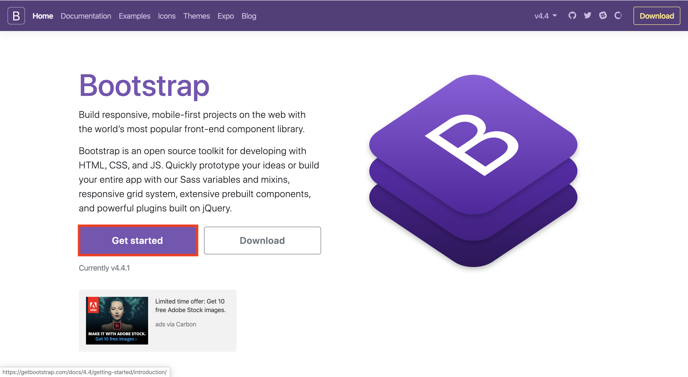

赤く囲った２つのリンクをhtmlファイルの中にコピーします。


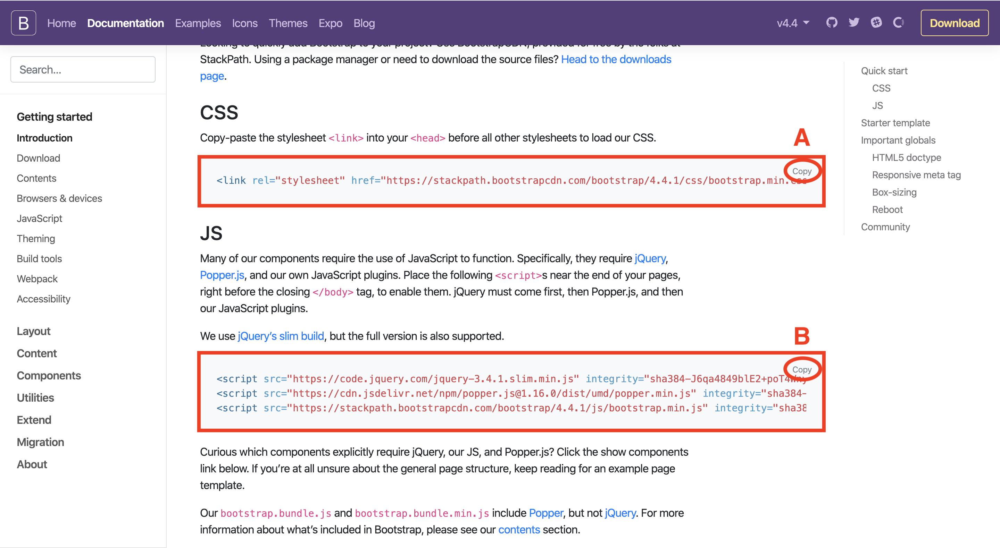

* CSSは`<head>`の中
* JSは`<body>`の中、一番下

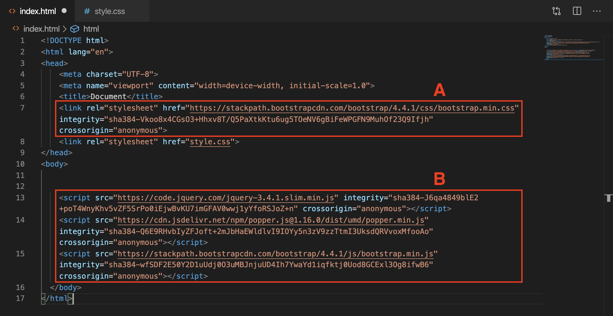

これで実際にBootstrapを使う準備ができました。

<br>
<br>

## 導入の流れ

Bootstrapのページに戻って左のバーから`Component`をクリックしてください。

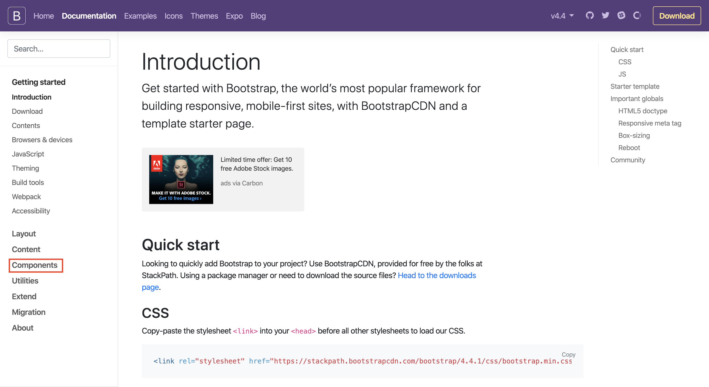

中にはたくさんの`Component`が入っています。
これらをコピー・編集・様々なコンポーネントを組み合わせて使うことで、簡単にきれいな見た目のウェブサイトが作れるというがBootstrapを使う利点です。

`Navbar`をクリックします。
`Navbar`とはNavigation barの略で、ページのトップにあり、他のページへのリンクなどがある横長の要素です。
Bootstrapのページでは紫色の部分がそれにあたります。

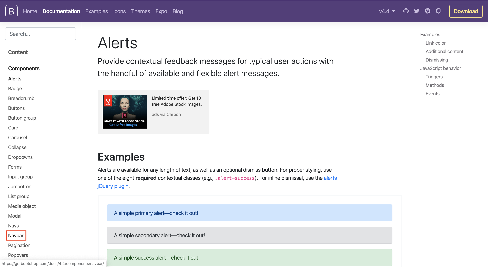

`Navbar`を開くと様々な種類の`Navbar`が載っています。
下の画像と同じものを見つけて、`Copy`をクリックします。

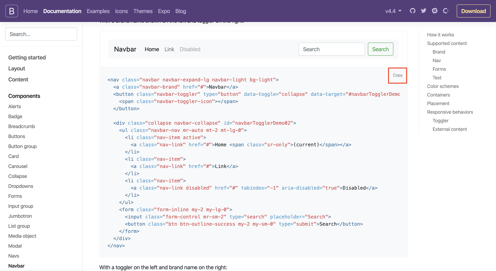

`<body>`の一番上にコピーしたものを貼り付けましょう。


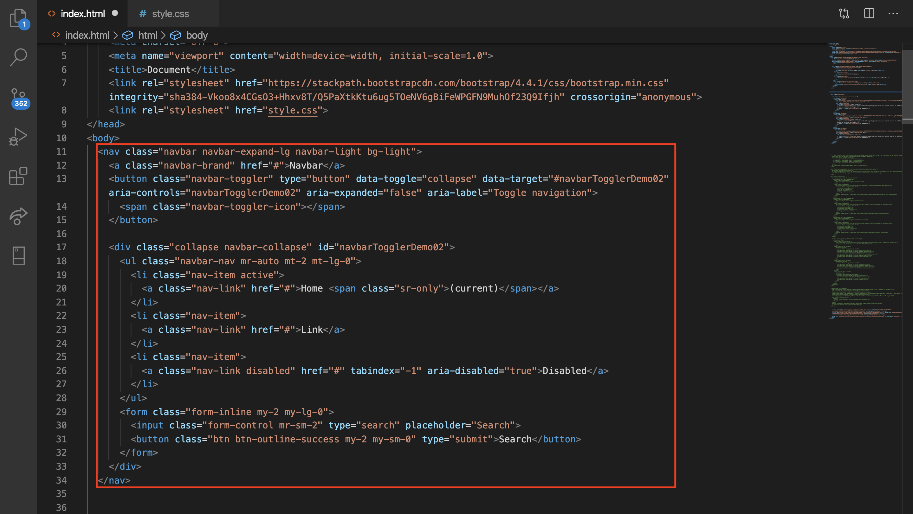


## クラス

ブラウザで確認すると、Navbarが追加されているのがわかります。
白の背景にグレーでは見づらいので、色を変えてみましょう。


`<nav>`タグの中のクラス、`navbar-light bg-light`を`navbar-dark bg-dark`に変更しましょう。


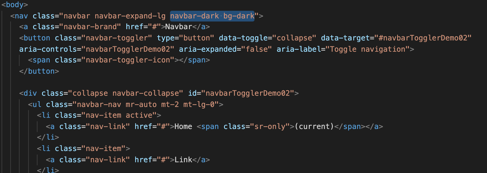

すると色が変更されているのがわかります。


このように、**Bootstrapでは、クラスに対応するCSSが用意されていて、クラスを変更することで色や大きさなどを変えることができます。**

今回はdarkという色を使いましたが、Bootstrapには色の名前が用意されています。
- [色の一覧](https://getbootstrap.com/docs/4.4/utilities/colors/)

例えば、`bg-dark`としたのを`bg-info`とすれば水色になります。

<br>
<br>

## レスポンシブ

冒頭の説明でもありましたが、Bootstrapは全ての要素が最初からレスポンシブに対応しています。
画面の幅を狭めて確認してみます。
先ほどまでに横に並んでいた文字がなくなり３本線の記号に変わっています。
これを「ハンバーガーメニュー」と呼びます🍔

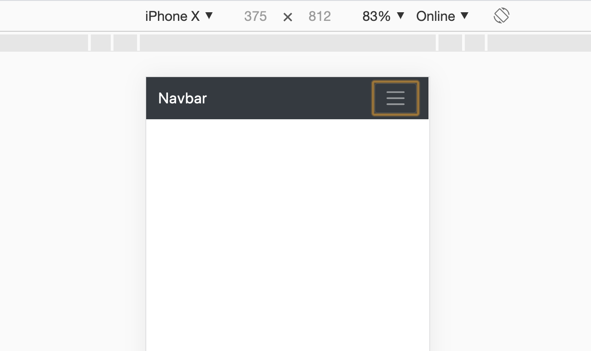

<br>
ハンバーガーメニューをクリックすると下に展開され、隠れていた先ほどのリンクが出たきます。これは「ドロップダウンメニュー」と呼ばれるものです。

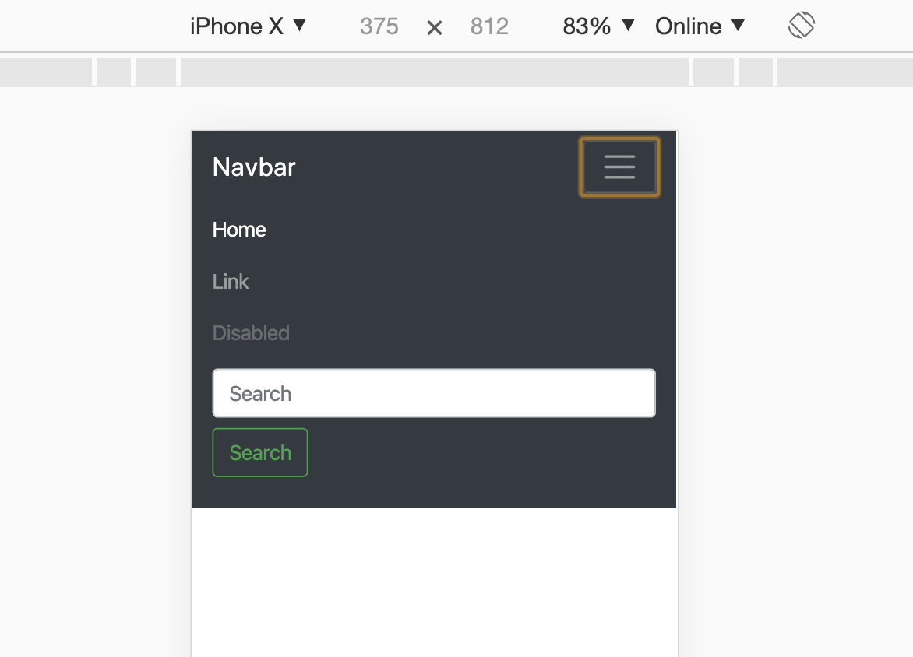

<br>
次に画像にあるような`Card`を取り入れてみたいと思います。

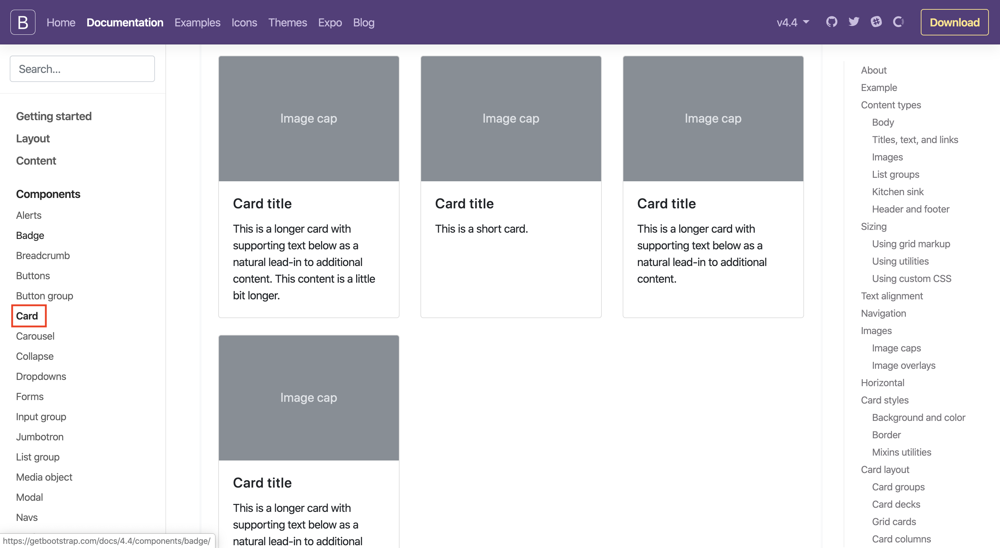

<br>
`Card`の中から画像にあるものと同じものを見つけて、コピーし、`index.html`の中に貼り付けます。

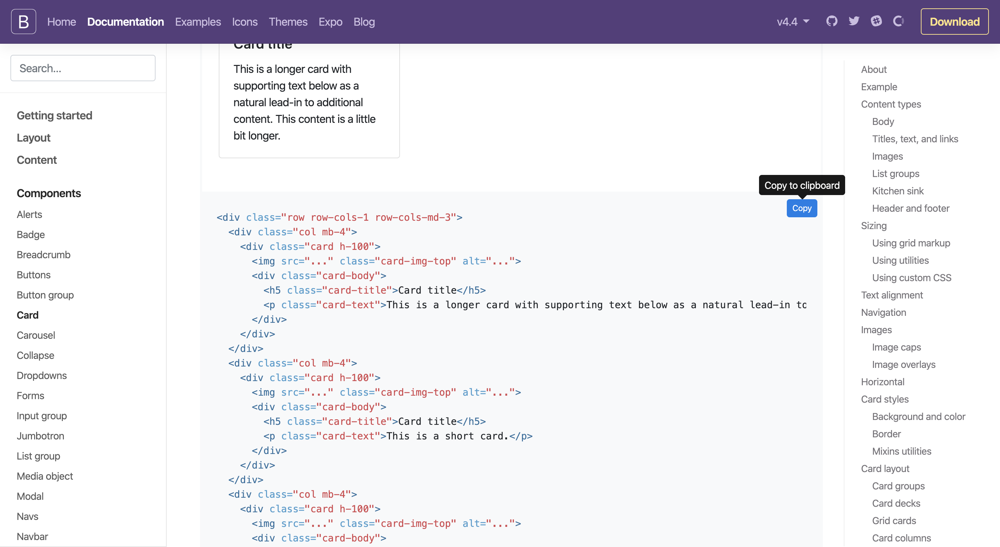

<br>
Bootstrapのウェブページ内に載っていたサンプルと若干違う見た目になってしまいます。
まず横幅が画面いっぱいに広がっています。

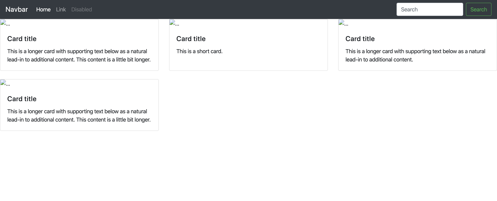
この場合、要素を
```html
    <div class="container">

    </div>
```
の中に入れることで、画面の横にスペースを作った見た目になります。


<br>

`card`と`navbar`の間に隙間がなかったので、`style.css`に以下のCSSを追加しておきます。

```css
.container {
    margin-top: 30px;
}
```

これで配置がきれいになりました。
次に``タグのリンクがデフォルトでは`"..."`になっているので、正しいリンクを貼りましょう。

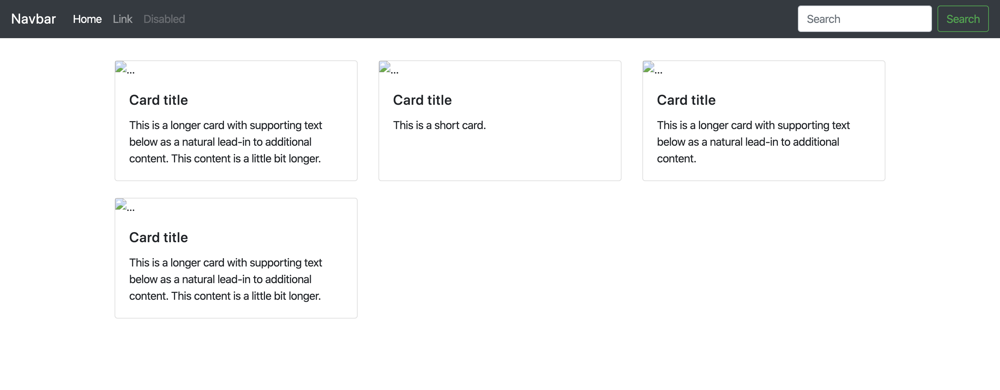

<br>
以下のリンクで好きな画像を見つけます。
画像を検索することができます。

https://unsplash.com/


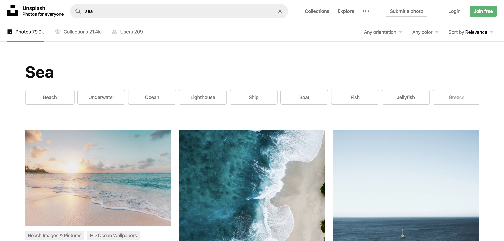

<br>
好きな画像をクリックすると拡大されて表示するので、画像のURLをコピーします。

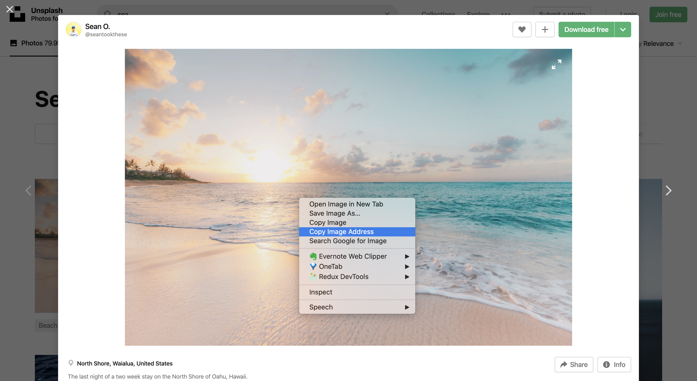

<br>
コピーしたURLを``タグの`src`に貼り付けます。

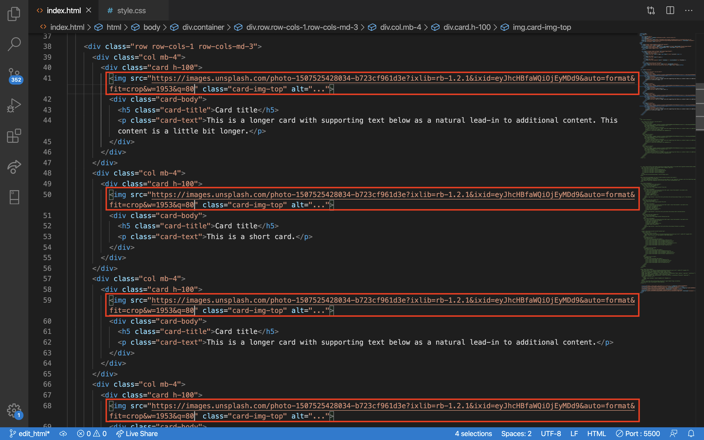

<br>
貼り付けた画像が表示されました。

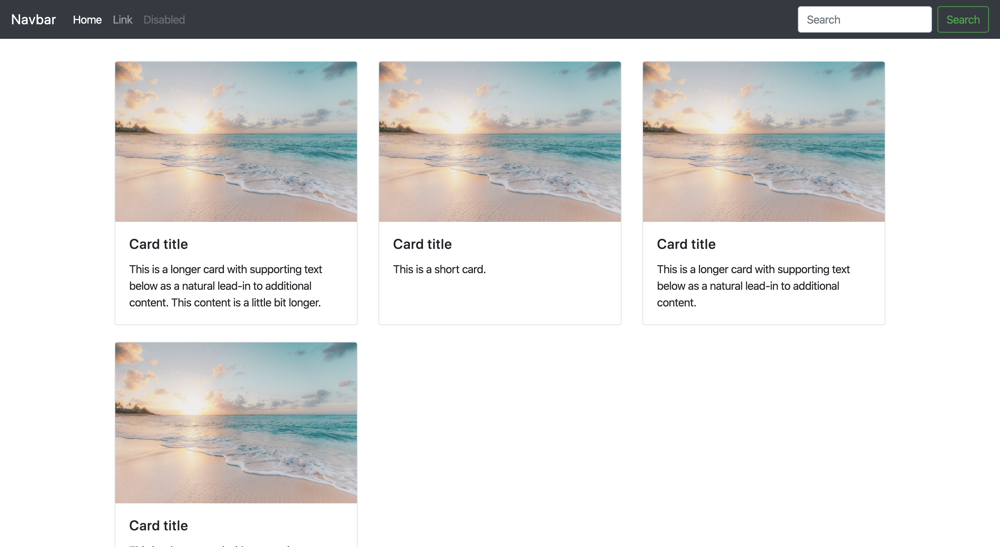

<br>
<br>

## 組み合わせ

最後に以下のようなボタンをカードの中に入れてみましょう。
画像内で青くハイライトされている部分がボタン要素なのでコピーしてください。

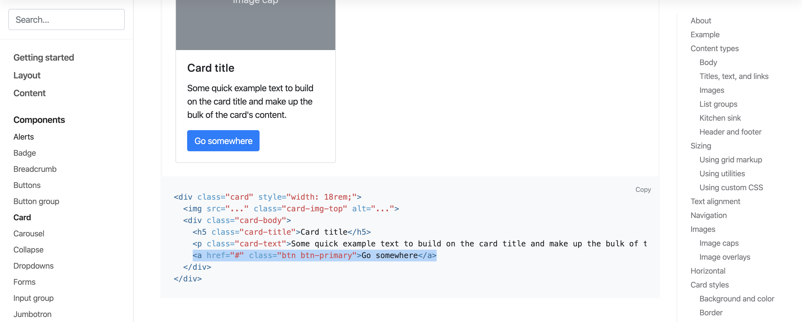

<br>

`<div class="card h-100">`内の`<p>`タグの下に貼り付けます。

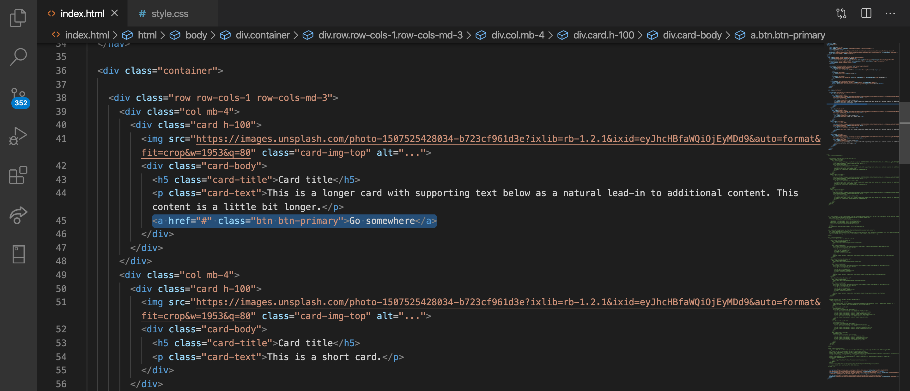

<br>
ボタンをカード内に取り入れることができました。


<br><br>
このように　Bootstrapには、特定のクラスに対応するCSSが用意されており、それを組み合わせることで、スピーディにきれいな見た目のウェブサイトを作ることができます。


ここではBootstrapの導入の仕方と、ごく一部のコンポーネントを紹介しました。
さらに学習したい人は、Bootstrapウェブサイト内をみて、自分で色々と試してみましょう。
